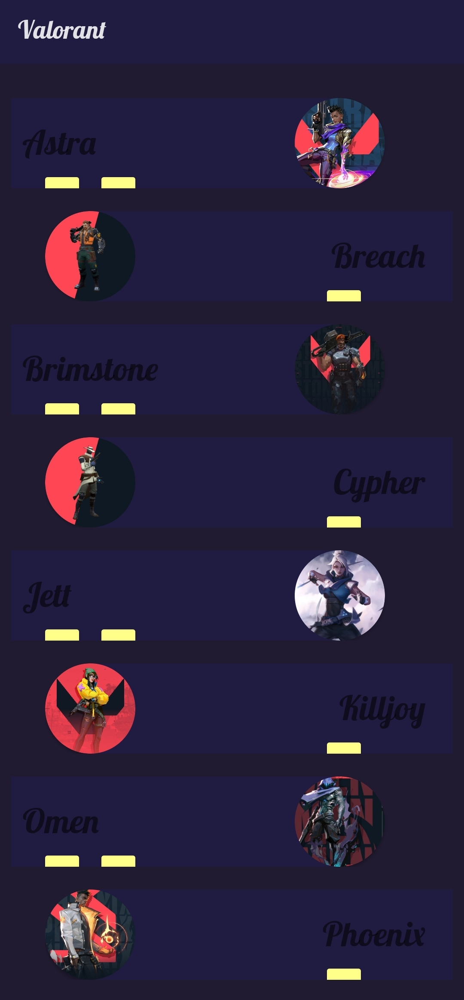
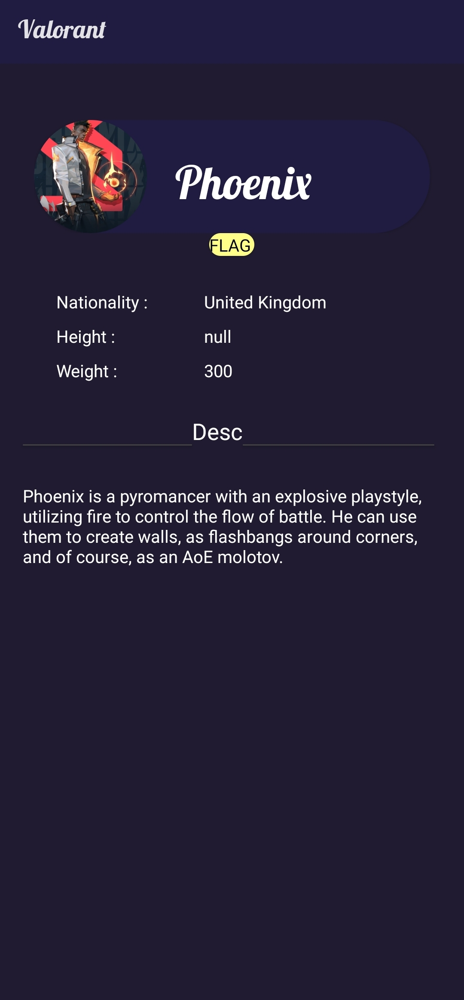

# Valorant

<h1 align="center">
    Valorant App - Android
</h1>

    
    
   
    
    

  <a href="/">Documentation</a> •
  <a href="/">Contribute</a> •
  <a href="/">Support</a> •
  <a href="/">Changelog</a> •
  <a href="/">Licensing</a>

The goal of this project is to develop a guide to official valorant game . the main attraction of this game is the wide variety of charector with UNIQUE abilities present on the game.our app provides a detail information about the charector and there abilities as well as there physical and general information.we used our own API to provide datas to the app. 

## Backend

Nodejs RESTFULL API is used to provide neccessary data to the Application.
you can use your custom API.

## Known Issues

* the app have layout fitting issues
* API is little bit slower to hit at initial touch
* Height-physical data of all charetor is missing 

## Images & Videos

The following are sample stills of the application:

Detailed Page

## cloning 

use this repo and simply clone
* first finish the gradle
* change the Base_URL with your API (MainActivity)
* Run the Application

## How to Contribute

Contribution and feedback are encouraged and always welcome. First report the issues and then inform the admin and then proccess according to contribution rule

## Contributors

*
*

## Repositories

*
*

## Licensing

Copyright (c) 2020-2021 SAP SE or an SAP affiliate company.

Licensed under the **Apache License, Version 2.0** (the "License"); you may not use this file except in compliance with the License.

You may obtain a copy of the License from [here](./LICENSE).

Unless required by applicable law or agreed to in writing, software distributed under the License is distributed on an "AS IS" BASIS, WITHOUT WARRANTIES OR CONDITIONS OF ANY KIND, either express or implied. See the [LICENSE](./LICENSE) for the specific language governing permissions and limitations under the License.

Please see the [detailed licensing information](/) via the [REUSE Tool](/) for more details.
